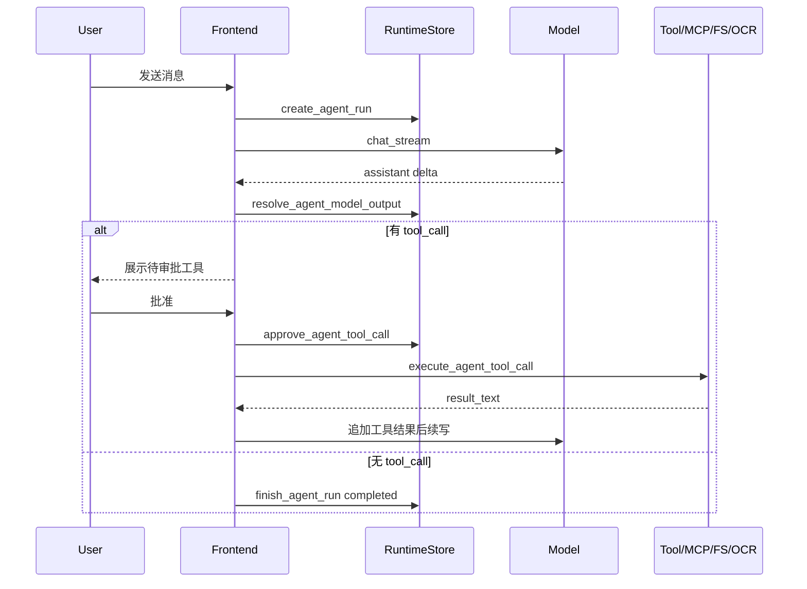

# Agent、RAG、MCP 与 Skills 设计

## 1. 模型上下文组装

前端每次发送消息前调用 `buildSystemMessage`，把运行环境组合进 system message：

- 当前项目名称、真实路径和文件树。
- 已连接 MCP 工具列表及参数 schema。
- 已启用 Skills 及自动运行参数。
- 启用的长期记忆。
- 当前对话 RAG 召回片段。
- OCR 图片附件提示。
- 工具调用协议说明。

这种方式让模型在没有原生 function calling 的情况下，仍能按约定输出 XML tool call。

## 2. Tool Call 协议

模型输出格式：

```xml
<tool_call name="read_file">
  <path>src/main.tsx</path>
</tool_call>
```

内置工具：

| 工具 | 风险 | 用途 |
| --- | --- | --- |
| `read_file` | 低 | 读取项目内 UTF-8 文本文件 |
| `write_file` | 高 | 创建或覆盖项目内 UTF-8 文本文件 |
| `execute_command` | 高 | 在项目目录执行命令 |
| `ocr_image` | 中 | 调用本机 PaddleOCR 识别项目内图片文字 |
| `mcp__server_id__tool_name` | 取决于 MCP server | 调用已连接 MCP 工具 |

所有工具当前都要求用户审批。命令执行还受前端 Skills 中 Bash Tool 启用状态影响。

## 3. Agent 运行时状态机

简化流程：



运行时库保留 run、step、tool call 三类记录。UI 可按会话展示最近运行过程，也可在问题排查时查看失败点。

## 4. RAG 设计

### 4.1 索引

RAG 索引流程：

1. 前端接收拖拽文件或文件路径。
2. 支持格式由前端判断，复杂文档由后端抽取文本。
3. 后端归一化文本。
4. 文本分块。
5. 调用 embedding API。
6. 写入文件、chunk、embedding 和 FTS 表。

当前限制：

- 单文件最多约 200 万字符。
- RAG 数据绑定到会话，不跨会话共享。
- embedding 使用 OpenAI-compatible `/embeddings`。
- 图片文件不进入 RAG 索引，而是作为 OCR 附件保存。

### 4.2 召回

发送消息前，前端调用 `search_rag_context`：

- 查询为空时直接返回空结果。
- 当前会话没有 RAG 文件时直接返回空结果。
- 后端为 query 创建 embedding。
- 使用向量相似度和 FTS 结果形成匹配。
- 结果以文件名、chunk index、score 和文本形式注入 system message。

## 5. OCR 图片附件设计

OCR 是 Agent 工具能力，不是 RAG 索引能力。用户不需要手写图片路径，前端会把图片保存为项目或临时目录内的相对路径，并把附件块写入消息。

图片入口：

1. 聊天输入区图片按钮接收浏览器 `FileList`。
2. 窗口拖拽接收系统文件路径。
3. `useChat` 按扩展名把图片和文本类文件分流；混合拖拽时图片进入 OCR 附件，文本进入 RAG。

保存流程：

1. 浏览器图片上传转为 base64，系统拖拽图片保留绝对 `source_path`。
2. 前端调用 `save_chat_image_attachment`。
3. Rust 后端通过传入的 `project_path` 解析根目录，校验格式、大小和文件名。
4. 图片写入 `.nano-agent/uploads/images/`，返回相对路径。
5. 前端把 `图片附件：<relative_path>` 追加到消息，提醒模型需要识别时调用 `ocr_image`。

渲染流程：

1. `renderMessageContent` 解析消息内容。
2. 包含图片附件时交给 `ImageAttachmentMessage`。
3. `ImageAttachmentMessage` 通过 `read_chat_image_attachment(projectPath, relativePath)` 读取 data URL。
4. 缩略图在聊天消息和归档预览中渲染，点击后打开大图预览。

附件根目录规则：

- 普通聊天页使用当前会话解析出的项目路径；没有项目时使用 `skills.tempDir`。
- 设置页 Archive 预览使用归档会话的 `project_path`；没有项目路径时回退到 `skills.tempDir`，保证旧的普通会话图片归档后仍可查看。

OCR 执行流程：

1. 模型输出 `ocr_image` tool call，参数是项目相对图片路径。
2. 用户审批后，后端再次校验路径位于根目录内、是普通文件、格式受支持且不超过 8MB。
3. 后端定位 `paddleocr` CLI，使用 PP-OCRv6 small 在 CPU 上执行，并用最长边、batch、线程和超时参数限制资源占用。
4. 识别结果作为工具结果消息回到对话，模型继续整理最终回答。

## 6. MCP 设计

MCP 配置保存在主业务库，运行 session 保存在内存。

支持 transport：

- `stdio`：启动本地命令，通过 stdin/stdout JSON-RPC 通信。
- `sse`：连接远端 SSE 服务。
- `streamable_http`：使用新版 MCP streamable HTTP。

连接流程：

1. 保存 server 配置。
2. 连接时先断开同 ID 旧 session。
3. 初始化 MCP session。
4. 调用 `tools/list`。
5. 工具列表保存到 session 内存并返回 UI。

调用流程：

1. 模型输出 `mcp__server_id__tool_name`。
2. 后端解析 server_id 和 tool_name。
3. 读取 `<arguments>` JSON。
4. 调用 MCP `tools/call`。
5. 返回 `content_json` 和 `is_error`。

## 7. Skills 设计

Skills 管理包含两类来源：

- GitHub 同步的 Anthropic Skills 元数据。
- Tauri app data 下的本地 `skills/` 目录。

前端保存 Skills 启用状态和参数。发送消息时，启用的 Skills 会被注入 system message。参数支持按当前项目自动替换：

- `workspace_root`
- `output_dir`
- `skills_root`

无项目上下文时，部分参数回退到 app data 下的 `temp/` 目录。

## 8. 上下文压缩

`useChat` 会估算当前消息 token。当历史上下文达到阈值且消息数量足够时：

1. 保留最近若干条消息。
2. 用当前模型总结更早消息。
3. 删除被压缩的旧消息。
4. 写入一条 system summary message。

这能降低长对话成本，但早期原文会被摘要替代。重要信息应进入长期记忆或项目文件。

## 9. 风险点

- XML tool call 协议依赖模型遵循提示，解析失败时需要用户重新引导。
- MCP 工具能力由外部 server 决定，风险边界不完全在 NanoAgent 内。
- 命令执行和文件写入是高风险能力，必须保留用户可见审批。
- RAG 召回质量取决于 embedding 模型、chunk 策略和源文档抽取质量。
- OCR 依赖本机 Python/PaddleOCR 环境，首次运行可能下载模型权重。
