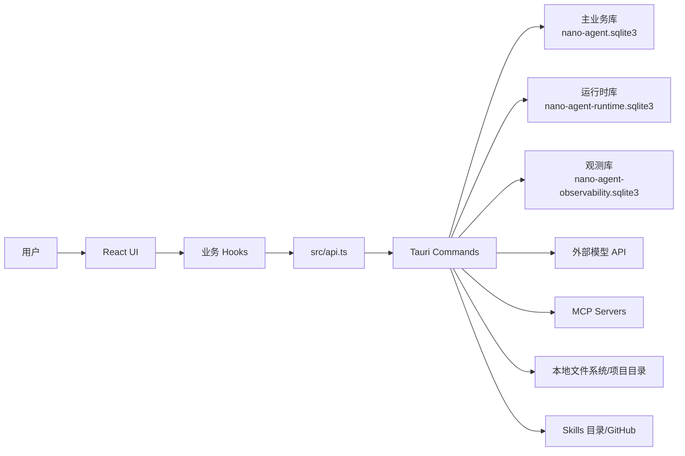

# NanoAgent 系统设计文档

## 1. 文档目的

本文档描述 NanoAgent 当前实现的系统边界、模块划分、关键数据流、存储设计、扩展机制和运维约束。它面向后续功能开发、架构评审、问题排查和打包发布。

更细的专题说明拆分在以下文档中：

- [架构与模块设计](architecture.md)
- [数据与存储设计](data-design.md)
- [Agent、RAG、MCP 与 Skills](agent-runtime.md)
- [构建、配置与运维](operations.md)

## 2. 系统定位

NanoAgent 是一个本地优先的桌面 AI 工作台。它不是纯聊天壳，而是把以下能力组合成一个可操作的本地客户端：

- 个人知识与工作信息管理：笔记、备忘录、提示词、长期记忆。
- AI 对话：多模型配置、流式输出、上下文压缩、会话归档。
- 项目工作区：按项目目录隔离会话，读写文件、浏览文件树、执行命令。
- 轻量 RAG：对话级文件上传、文本抽取、分块、embedding、召回。
- Agent 工具执行：模型输出工具请求，用户审批后执行，再把结果回传给模型。
- 扩展系统：MCP 服务器、本地/远程 Skills、Tavily 搜索配置。
- 运行时可观测：LLM/MCP/工具调用等行为写入独立观测库并在设置中展示。

## 3. 总体架构

系统采用 Tauri 桌面架构：

- 前端使用 React + TypeScript，负责界面、用户交互、流式事件监听和本地状态组合。
- Tauri command 是前后端边界，所有数据库、文件系统、命令执行、模型请求和 MCP 操作都经由 command。
- Rust 后端负责持久化、外部 API 调用、文件安全边界、MCP 会话管理、运行时记录和观测管线。
- SQLite 是本地状态中心，按业务、Agent 运行时、观测三类拆分。

## 4. 主要模块

| 层级 | 关键文件 | 职责 |
| --- | --- | --- |
| UI | `src/App.tsx`、`src/components/*` | 页面布局、侧栏、聊天区、设置弹窗、观测面板、运行时面板 |
| 前端 API | `src/api.ts` | 封装 `invoke`，提供类型化 command 调用入口 |
| 前端业务状态 | `src/hooks/*` | 对话、模型、项目、RAG、MCP、Skills、记忆、观测等状态组合 |
| 前端工具 | `src/lib/*` | 系统提示构造、工具调用解析、格式化、Agent 安全包装 |
| Tauri 入口 | `src-tauri/src/lib.rs` | 应用状态、command 注册、系统托盘、数据库初始化 |
| 主业务存储 | `src-tauri/src/db.rs` | items、model_configs、mcp_servers、conversations、messages、RAG、memories |
| Agent 运行时 | `src-tauri/src/runtime.rs` | agent_runs、agent_steps、agent_tool_calls |
| 观测管线 | `src-tauri/src/observability.rs` | `ObservabilitySink`、`ObservabilityPipeline`、SQLite sink |
| 模型访问 | `src-tauri/src/llm.rs` | OpenAI-compatible、Anthropic、streaming、embeddings |
| MCP | `src-tauri/src/mcp.rs` | stdio/SSE/streamable HTTP 会话管理和工具调用 |
| Agent 工具解析 | `src-tauri/src/agent_runner.rs` | 工具定义、XML tool_call 解析、参数校验 |
| Skills | `src-tauri/src/skills.rs` | GitHub Skills 同步、本地 Skills 目录读取 |

## 5. 关键业务链路

### 5.1 普通对话

1. 用户输入消息。
2. 前端确保当前 scope 下存在会话，scope 可以是普通会话或项目会话。
3. 用户消息写入 `messages`。
4. 前端创建 `agent_run`，记录用户消息 step。
5. 前端读取启用记忆、项目文件树、RAG 召回、启用 Skills 和已连接 MCP 工具。
6. `buildSystemMessage` 组装系统上下文。
7. `chat_stream` command 发起模型流式请求。
8. Rust 后端通过 Tauri event `chat-stream` 回传 delta、reasoning_delta 或 error。
9. 前端临时展示流式消息，完成后写入正式 assistant message。
10. 后端/前端记录 Agent step，并尝试解析 assistant 输出中的工具调用。

### 5.2 RAG 文件索引与召回

1. 用户拖拽或选择文件。
2. 前端读取文件内容，或调用 `read_absolute_file` 让 Rust 抽取 PDF、docx、pptx、xlsx 等文本。
3. `index_rag_file` 对文本归一化、分块，并调用 embedding API。
4. 主业务库写入 `rag_files`、`rag_chunks`、`rag_embeddings` 和 `rag_chunks_fts`。
5. 对话发送前调用 `search_rag_context`，结合 FTS 和向量匹配召回片段。
6. 召回结果注入 system message，只在当前对话中生效。

### 5.3 Agent 工具调用

1. 模型按系统提示输出 `<tool_call name="...">`。
2. 前端和后端都具备 tool_call 解析能力，后端负责权威校验。
3. `resolve_agent_model_output` 将工具调用写入 `agent_tool_calls`，状态为待处理。
4. UI 展示可执行工具调用，用户选择批准或拒绝。
5. 批准后 `execute_agent_tool_call` 执行文件读写、命令或 MCP 工具。
6. 执行结果作为用户消息回写对话。
7. 前端再次触发模型继续回复，直到没有新工具调用或运行结束。

### 5.4 MCP 工具扩展

1. 用户在设置中保存 MCP server 配置。
2. `connect_mcp_server` 根据 transport 建立 stdio、SSE 或 streamable HTTP 会话。
3. 后端调用 `tools/list` 获取工具清单。
4. 已连接工具以 `mcp__server_id__tool_name` 形式注入 system message。
5. 模型发起 MCP tool_call 后，后端调用 `tools/call` 并把结果回传对话。

### 5.5 观测链路

1. Tauri command 在关键操作前调用 `start_observation`。
2. `ObservabilityPipeline` 创建 span，并写入所有 sink。
3. 操作完成后调用 `finish_observation` 写入状态、耗时、摘要和错误。
4. 默认 sink 是独立 SQLite：`nano-agent-observability.sqlite3`。
5. 设置页通过 `list_observability_spans` 查看 trace 分组和时间线。

## 6. 存储设计概览

NanoAgent 使用三份 SQLite 数据库：

| 数据库 | 职责 | 主要表 |
| --- | --- | --- |
| `nano-agent.sqlite3` | 主业务数据 | `items`、`model_configs`、`mcp_servers`、`conversations`、`messages`、`rag_*`、`memories` |
| `nano-agent-runtime.sqlite3` | Agent 运行时 | `agent_runs`、`agent_steps`、`agent_tool_calls` |
| `nano-agent-observability.sqlite3` | 观测数据 | `observability_spans` |

拆分原因：

- 主业务数据保持稳定、可备份、可迁移。
- Agent 运行时属于过程记录，可以独立清理或演化。
- 观测数据高频、可丢弃，不能阻断业务或污染主库。

详细表结构见 [数据与存储设计](data-design.md)。

## 7. 安全与边界

- 项目文件操作必须从 `project_path` 解析项目根目录，并通过相对路径归一化避免越界。
- 高风险工具如 `write_file`、`execute_command` 必须经过用户审批。
- 命令执行默认在项目目录下运行，并由前端 Skills 开关控制 Bash Tool 是否可执行。
- RAG 单文件文本有大小限制，避免一次性索引超大内容。
- embedding API key 缺失时，只允许 localhost 这类本地服务绕过 key。
- 观测写入失败只打印错误，不影响主流程。
- MCP stdio 子进程在 Windows 下使用 `CREATE_NO_WINDOW`，避免弹出额外窗口。

## 8. 扩展方向

- 新模型 provider：扩展 `llm.rs` 的 provider 分派和请求/流式解析。
- 新 Agent 工具：扩展 `agent_runner.rs` 的工具定义、参数校验和 `lib.rs` 的执行分派。
- 新 MCP transport：扩展 `mcp.rs` 的 `McpSession`。
- 新观测 sink：实现 `ObservabilitySink` 并加入 `ObservabilityPipeline`。
- 新业务对象：优先放入主业务库；如果是运行过程或高频日志，应考虑独立库。
- 新设置页：前端在 `SettingsModal` 增加 tab，后端通过 command 暴露持久化能力。

## 9. 当前约束

- 文本编码和部分历史中文字符串曾出现乱码，后续修改中文 UI/文档时应统一使用 UTF-8。
- 前端缺少自动化测试，当前主要验证方式是 `npm.cmd run build`、`cargo check` 和实际 Tauri 运行。
- RAG 是轻量实现，适合对话级文件辅助，不等价于完整知识库系统。
- Agent 工具协议采用 XML 标签约定，不是模型原生 function calling。
- 本地 Skills 的执行能力依赖 Node.js、Python 和相关命令环境。

